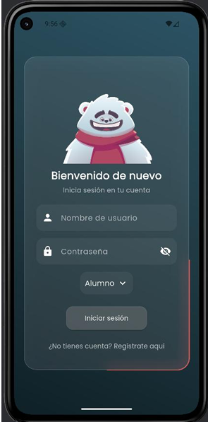
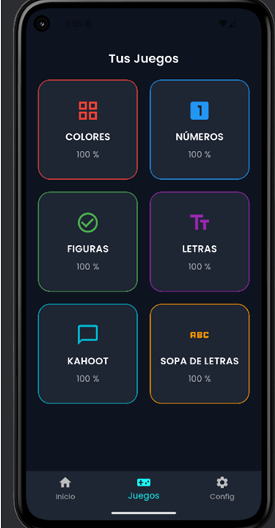

Aplicación móvil educativa desarrollada con Flutter, diseñada para facilitar el aprendizaje interactivo mediante cursos, materiales de estudio, evaluaciones y seguimiento del progreso académico.

## 🚀 Características

- 📖 Visualización de cursos y contenidos educativos.
- 🎥 Acceso a recursos multimedia.
- 📝 Evaluaciones y cuestionarios.
- 📊 Seguimiento del progreso del estudiante.
- 🔐 Inicio de sesión y gestión de usuarios.
- ☁️ Integración con Firebase.
- 📱 Compatible con Android.

## 🛠️ Tecnologías Utilizadas

- Flutter
- Dart
- Firebase Authentication
- Cloud Firestore
- Firebase Storage
- Provider / Riverpod (según corresponda)
- Material Design
  
## 📸 Capturas de Pantalla

<p align="center">
  
    
  
  
</p>

  ## ⚙️ Instalación

### Clonar el repositorio

```bash
git clone (https://github.com/Ener25/Aplicacion-educativa-.git)
```

### Entrar al proyecto

```bash
cd Aplicacion-educativa
```

### Instalar dependencias

```bash
flutter pub get
```

### Ejecutar la aplicación

```bash
flutter run
```

## 🔥 Configuración de Firebase

1. Crear un proyecto en Firebase.
2. Registrar la aplicación Android.
3. Descargar el archivo `google-services.json`.
4. Colocarlo en:

```text
android/app/google-services.json
```

5. Ejecutar:

```bash
flutterfire configure
```

## 🎯 Funcionalidades Futuras

- Certificados digitales.
- Chat entre estudiantes y docentes.
- Sistema de notificaciones.
- Modo offline.
- Videollamadas educativas.
- Inteligencia artificial para tutorías.

## 👨‍💻 Autor

**Ener Jesus Debol Victoria**

Ingeniero en Sistemas Computacionales

📧 enerdebol@gmail.com

🌐 Portafolio:
https://ener25.github.io/

## 📄 Licencia

Este proyecto está bajo la licencia MIT.
